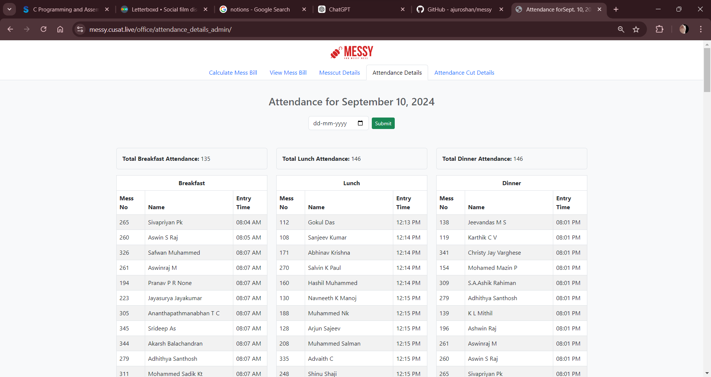
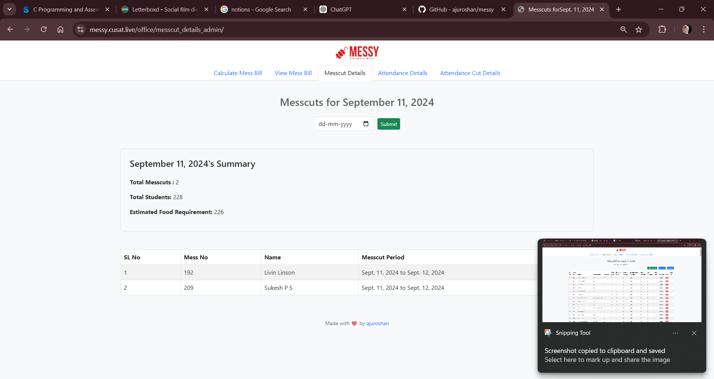
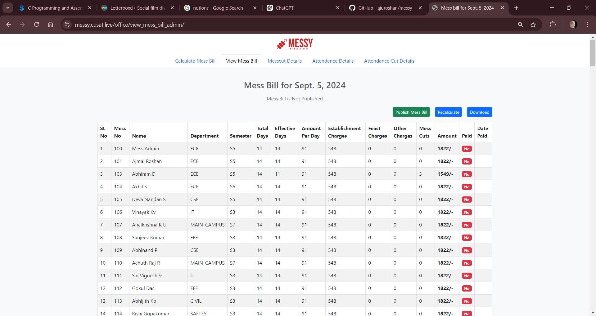
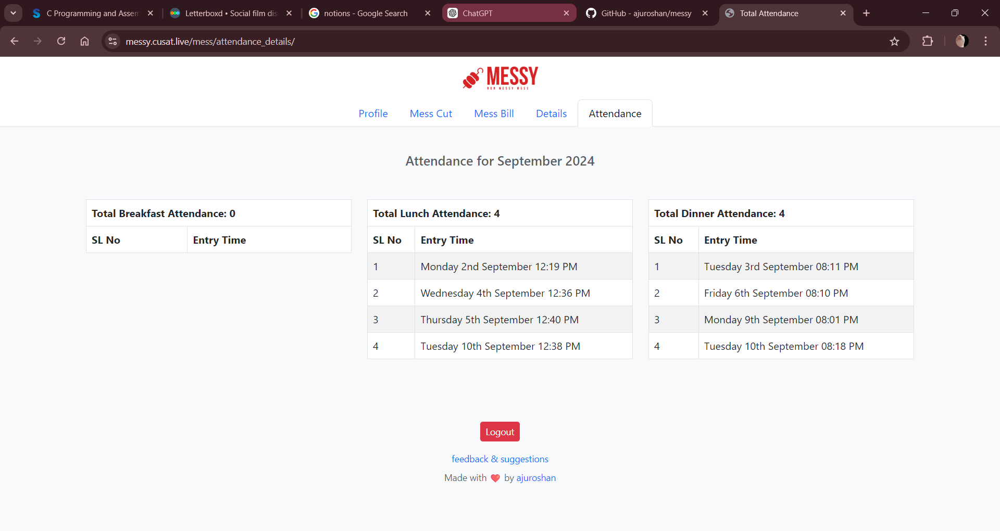
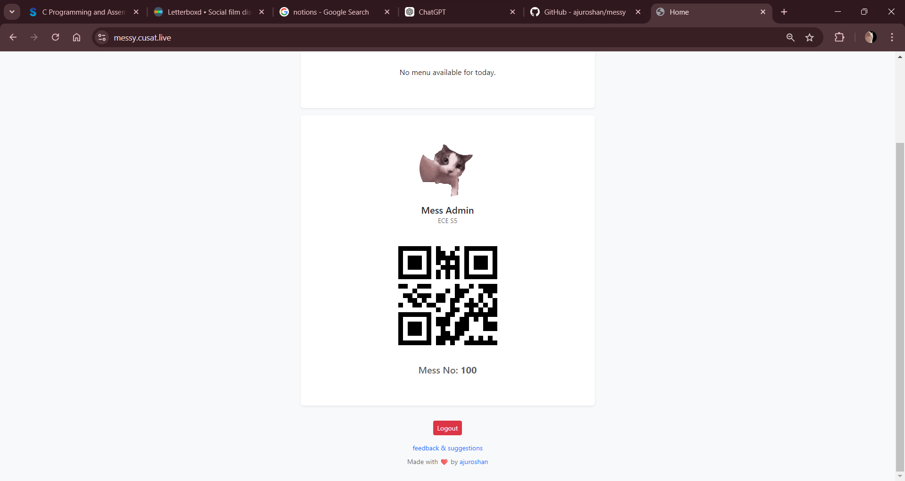

# Hostel Mess Management System

Hostel Mess Management System is a Django-based web application designed to streamline the management of hostel mess operations. The application allows users to apply for mess cuts, mark attendance via QR code scanning, view and pay mess bills, check weekly menus, and provide feedback.

## Features

- **Messcut Application**: Users can apply for mess cuts with validation for overlapping dates and maximum allowable days per month.
- **QR Code Attendance**: Mess assistants can scan QR codes to mark attendance, with automatic validation against mess cuts and meal times.
- **Mess Bill Management**: Users can view and pay their mess bills online. Mess administrators can generate and export bill details.
- **Weekly Menu**: Users can view the weekly mess menu.
- **Feedback System**: Users can submit feedback directly through the application.

## Installation

1. **Clone the Repository:**
   ```bash
   git clone https://github.com/yourusername/hostel-mess-management.git
   cd hostel-mess-management
   ```

2. **Set Up Virtual Environment:**
   ```bash
   python3 -m venv venv
   source venv/bin/activate
   ```

3. **Install Dependencies:**
   ```bash
   pip install -r requirements.txt
   ```

4. **Run Migrations:**
   ```bash
   python manage.py migrate
   ```

5. **Create a Superuser:**
   ```bash
   python manage.py createsuperuser
   ```

6. **Run the Development Server:**
   ```bash
   python manage.py runserver
   ```

7. **Access the Application:**
   Open your browser and navigate to `http://127.0.0.1:8000`.

## Screenshots

*Add screenshots here to demonstrate key features of the application.*

- **Dashboard:**
  

- **Apply for Messcut:**
  

- **QR Code Scanning:**
  

- **View and Pay Mess Bill:**
  

- **View and Pay Mess Bill:**
  

- **View and Pay Mess Bill:**
  

## Usage

- **Students**: Log in to apply for mess cuts, view weekly menus, check and pay your mess bills, and submit feedback.
- **Mess Assistants**: Use the QR code scanning feature to mark attendance and manage mess operations.
- **Admins**: Oversee the entire system, manage users, and export bill data to CSV if needed.

## Contribution

Contributions are welcome! Feel free to open issues or submit pull requests.

## Contact

For any inquiries, please contact us at `ajuaju0483@gmail.com`.
```

You can copy and paste this into your `README.md` file on GitHub.
